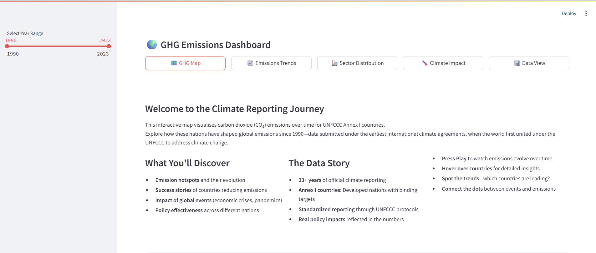
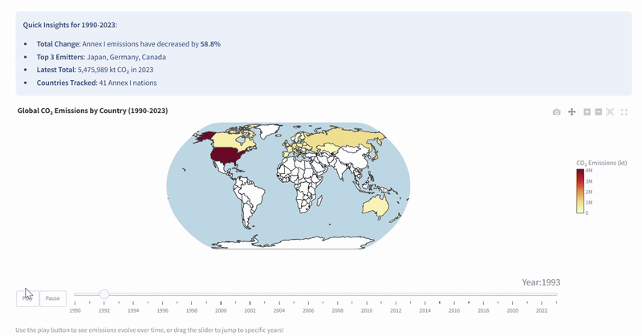

# 🌍 GHG Emissions Dashboard

**An interactive web application for exploring global greenhouse gas emissions data with advanced UNFCCC data processing capabilities**

[](https://ghg-emissions-dashboard.streamlit.app)
[](https://www.python.org/downloads/)
[](https://opensource.org/licenses/MIT)

---

##  **Live Dashboard**

**👉 [Explore the Dashboard Here](https://ghg-emissions-dashboard.streamlit.app) 👈**

*Dive into 30+ years of climate data from UNFCCC Annex I countries with interactive visualizations, policy analysis, and climate impact connections.*



*Main dashboard interface showing global emissions data with interactive filtering options*

## Features

- **Interactive GHG Map**: Global visualization of CO₂ emissions by country with time-series animation
- **Emissions Trends**: Detailed analysis of emission trends for individual countries
- **Sector Distribution**: Breakdown of emissions by economic sectors and sub-sectors
- **Climate Impact**: Analysis of climate change impacts and projections
- **Data View**: Raw data exploration and filtering capabilities
---

##  **Dashboard Preview**

### 🗺️ Interactive Global Emissions Map


*Watch global CO₂ emissions evolve over time with our animated choropleth map*

### 📈 Country-Specific Emissions Analysis  

*Deep-dive into individual country emission trajectories and multi-gas analysis*

#### Sector Distribution

*Breakdown of emissions by economic sectors and sub-sectors*

### Data   View

## **What Makes This Special?**

**Interactive Storytelling**: Navigate through 30+ years of climate data with engaging visualizations  
**Scientific Rigor**: Built on official UNFCCC data with comprehensive quality validation  
**Policy Integration**: Country-specific climate policies mapped to emission sectors  
**Impact Connection**: Links emissions to temperature changes and extreme weather events  
**Data Accessibility**: Download processed datasets in multiple formats  
**High Performance**: Smart caching and optimized data processing for instant interactions  

---

---

##  **Quick Start**

### **Option 1: Use the Live Dashboard (Recommended)**
Simply visit **[the live dashboard](https://ghg-emissions-dashboard.streamlit.app)** - no installation required!

### **Option 2: Run Locally**

### **1. Clone Repository**
```bash
git clone https://github.com/yourusername/GHG_dashboard.git
cd GHG_dashboard
```

### **2. Set Up Environment**
```bash
# Create isolated Python environment
python -m venv ghg_env

# Activate environment
# On macOS/Linux:
source ghg_env/bin/activate
# On Windows:
ghg_env\Scripts\activate
```

### **3. Install Dependencies**
```bash
# Install all required packages
pip install -r requirements.txt

# Verify installation
python -c "import streamlit; print('Streamlit installed successfully')"
```
### **4. Launch Dashboard**
```bash
# Start the application
streamlit run main.py

# Optional: Run on specific port
streamlit run main.py --server.port 8502
```

### **5. Access Dashboard**
**Open your browser to:**
- **Local URL**: `http://localhost:8501`
- **Network URL**: `http://your-ip:8501` (for sharing on local network)

---

## 📋 **System Requirements**

### **Minimum Requirements**
- **Python**: 3.8 or higher
- **RAM**: 4GB (8GB recommended for large datasets)
- **Storage**: 2GB free space
- **Browser**: Chrome 90+, Firefox 88+, Safari 14+

### **Recommended Setup**
- **Python**: 3.10+
- **RAM**: 8GB+
- **CPU**: Multi-core processor for faster data processing
- **Internet**: Stable connection for initial data loading

---

##  **UNFCCC Data Processing Pipeline**

This project includes a **sophisticated data processing package** specifically designed for handling complex UNFCCC (United Nations Framework Convention on Climate Change) data files.

### **Why This Matters**
UNFCCC data files are notoriously difficult to work with:
-  Inconsistent Excel file structures
-  Multi-level headers with embedded units
-  Hierarchical category systems
-  Country-specific formatting variations
-  Complex gas-specific breakdowns

**This pipeline solves all of these challenges automatically!**

### **Pipeline Components**

```
ghg_processing/
├── unfccc/
│   ├── header_detector.py      # Smart header detection
│   ├── process_hierarchy.py    # IPCC category organization  
│   ├── save_gases.py          # Gas-specific data extraction
│   └── process_sheets.py      # Batch processing workflows
└── climate_impact/
    ├── extreme_weather.py     # EM-DAT disaster data
    ├── global_emissions.py    # Our World in Data processing
    └── temperature.py         # NASA temperature data
```

### ** Key Features**
- ** Intelligent Header Detection**: Automatically finds data tables in complex Excel sheets
- ** Hierarchical Processing**: Organizes emissions into IPCC-compliant category structures
- ** Multi-Gas Extraction**: Separates CO₂, CH₄, N₂O, SF₆, HFCs, PFCs with proper units
- ** Batch Processing**: Handle multiple countries and years simultaneously
- ** Quality Validation**: Comprehensive data cleaning and validation
- ** Efficient Storage**: Outputs to both Parquet (fast) and CSV (readable) formats

### ** Complete Processing Guide**

For detailed examples and tutorials, see  **[Processing Examples Notebook](example_use.ipynb)**

#### **Quick Processing Example**
```python
from ghg_processing.unfccc.process_sheets import process_summary_sheet

# Process a single country
process_summary_sheet(
    sheet_name="Summary2",
    folder_path="data/crt/Australia", 
    output_folder="data/processed_data",
    save_csv=True
)
```

#### **Batch Processing Multiple Countries**
```python
import os
from ghg_processing.unfccc.process_sheets import process_summary_sheet

# Process all countries at once
countries = ["Australia", "United Kingdom", "United States", "Germany"]
for country in countries:
    print(f"Processing {country}...")
    process_summary_sheet("Summary2", f"data/crt/{country}", "data/processed_data")
```

### ** Supported Data Sources**
- **UNFCCC CRT Files**: National greenhouse gas inventories
- **EM-DAT Database**: International disaster database  
- **NASA GISS**: Global temperature records
- **Our World in Data**: Global emissions datasets

---

##  **Project Structure**

```
GHG_dashboard/
├──  main.py                     # Main Streamlit application
├──  data_loader.py              # Data loading & caching utilities  
├──  utils.py                    # Helper functions & sidebar components
├──  requirements.txt            # Python dependencies
├──  countries.geo.json          # Geographic data for mapping
|
├── data/                       # Data storage directory
│   ├── processed_data/            # Processed UNFCCC data by country
│   ├── EM-DATA/                   # Climate impact datasets
    ├── csv_view                   # Output CSV for preprocessing 
│   └── crt/                       # Raw UNFCCC files (user-provided)
    
|
├── views/                      # Dashboard page modules
│   ├── ghg_map.py                 # Interactive world map
│   ├── emissions_trends.py       # Country emission analysis
│   ├── sector_distribution.py    # Sectoral breakdown & policies
│   ├── climate_impact.py         # Climate impact connections
│   └── data_view.py              # Data exploration & downloads
|
├── data_content/               # Static content & explanations
│   ├── policy_data.py             # Country climate policies
│   ├── sector_goals.py            # Global climate commitments
│   ├── gas_information.py         # Greenhouse gas explanations
│   └── chart_explanations.py     # Country-specific insights
|
├── ghg_processing/             # Data processing pipeline
│   ├── unfccc/                    # UNFCCC data processing
│   └── climate_impact/            # Climate data processing
├── images/                     # Screenshots & documentation
├── example_processing/         # Example preprocessing            
│   ├── example_use.ipynb       # Processing tutorial notebook           
|   ├── Australia/              # Preprocessing demo for Australia
|   ├── Table1_B_2              # Preprocessing ouput for Table1.B.2
|   └── csv_view                # Preprocessing output examples in CSV 
          
```

---

##  **Data Download & Usage**

### **Download Processed Data**

The dashboard provides multiple ways to access the data:

#### **1. Through Dashboard Interface**
- Navigate to **Data View** page
- Select your desired dataset
- Filter by year range if needed
- Click **"Download as CSV"** button

#### **2. Direct File Access**
```bash
# Processed data location
data/processed_data/
├── Australia/
│   ├── total/           # National totals
│   ├── sectors/         # Sector-level data  
│   ├── subsectors/      # Detailed sectoral breakdowns
│   └── co₂/             # CO₂-specific data (if applicable available for all GHG gases)
│       ├── total/           # National totals
│       ├── sectors/         # Sector-level data  
│       └── subsectors/         
├── United Kingdom/
└── ...
```

#### **3. Programmatic Access**
```python
import pandas as pd

# Load country total emissions
df = pd.read_parquet('data/processed_data/Australia/total/Australia_total_combined.parquet')

# Load sector breakdown
sectors = pd.read_parquet('data/processed_data/Australia/sectors/Australia_sectors_combined.parquet')

# Load climate impact data
weather = pd.read_parquet('data/EM-DATA/summary_extreme_weather_all_countries.parquet')
```

### **📋 Available Datasets**

| Dataset | Description | Format | Size |
|---------|-------------|--------|------|
| **Total Emissions** | National-level GHG totals | Parquet/CSV | ~50KB per country |
| **Sector Emissions** | Breakdown by economic sector | Parquet/CSV | ~200KB per country |
| **Subsector Emissions** | Detailed sectoral breakdown | Parquet/CSV | ~500KB per country |
| **Gas-Specific Data** | Individual greenhouse gases | Parquet/CSV | ~100KB per gas/country |
| **Extreme Weather** | Climate disaster records | Parquet/CSV | ~2MB global |
| **Temperature Data** | Global temperature anomalies | Parquet/CSV | ~50KB global |

---

## 🔧 **Development & Customisation**

### ** For Developers**

```bash
# Clone for development
git clone https://github.com/yourusername/GHG_dashboard.git
cd GHG_dashboard

# Install dependencies
pip install -r requirements.txt

# Run in development mode with auto-reload
streamlit run main.py --server.runOnSave true
```

### **🔄 Adding New Data**

#### **1. Add New Country Data**
```bash
# Place UNFCCC files in:
data/crt/[CountryName]/[CountryCode]-CRT-[Year]-[Version].xlsx

# Process the data:
python -c "
from ghg_processing.unfccc.process_sheets import process_summary_sheet
process_summary_sheet('Summary2', 'data/crt/NewCountry', 'data/processed_data')
"
```

#### **2. Process Climate Impact Data**
```python
# Update extreme weather data
from ghg_processing.climate_impact.extreme_weather import process_extreme_weather_data
process_extreme_weather_data('data/raw/new_emdat.xlsx', 'data/EM-DATA/extreme_weather.parquet')

# Update temperature data  
from ghg_processing.climate_impact.temperature import process_temperature_anomalies
process_temperature_anomalies('data/raw/nasa_temp.csv', 'data/EM-DATA/temperature.parquet', (1990, 2024))
```

---

## 📊 **Data Sources & Methodology**

### **🏛️ Primary Data Sources**

| Source | Dataset | Coverage | Update Frequency |
|--------|---------|----------|------------------|
| **UNFCCC** | National GHG Inventories | Annex I Countries, 1990-2023 | Annual |
| **EM-DAT** | International Disaster Database | Global extreme weather events | Real-time |
| **NASA GISS** | Global Temperature Analysis | Global temperature anomalies | Monthly |
| **Our World in Data** | Global Emissions Database | World emission totals | Annual |


## 📄 **License & Attribution**

### **License**
This project is licensed under the **MIT License** - see the [LICENSE](LICENSE) file for details.

### **Data Attribution**
- **UNFCCC Data**: © United Nations Framework Convention on Climate Change
- **EM-DAT Data**: © Centre for Research on the Epidemiology of Disasters (CRED)
- **NASA Data**: © National Aeronautics and Space Administration
- **Our World in Data**: © Global Change Data Lab

### **Citation**
If you use this dashboard in your research, please cite:
```
GHG Emissions Dashboard (2024). Interactive Climate Data Visualization Platform.
Available at: https://ghg-emissions-dashboard.streamlit.app
```

---

## 🙏 **Acknowledgments**

- **UNFCCC** for providing comprehensive greenhouse gas inventory data
- **NASA GISS** for global temperature analysis
- **EM-DAT** for international disaster database
- **Streamlit** for the amazing web application framework
- **Open Source Community** for continuous support and contributions

---

<div align="center">
  
**Made with ❤️ for our planet 🌍**

*Every line of code contributes to better climate understanding*

</div>
