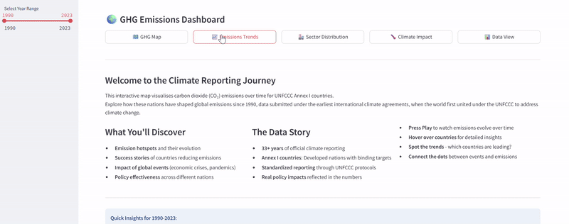
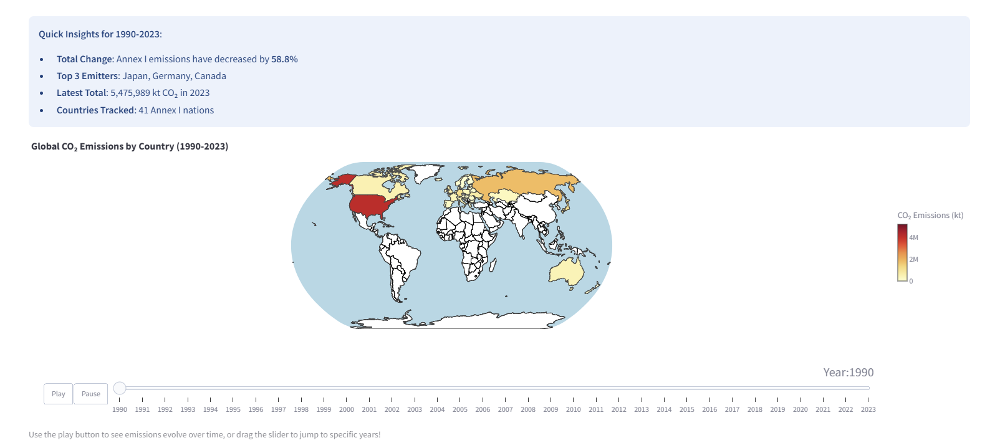
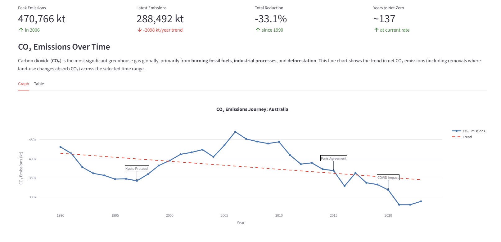
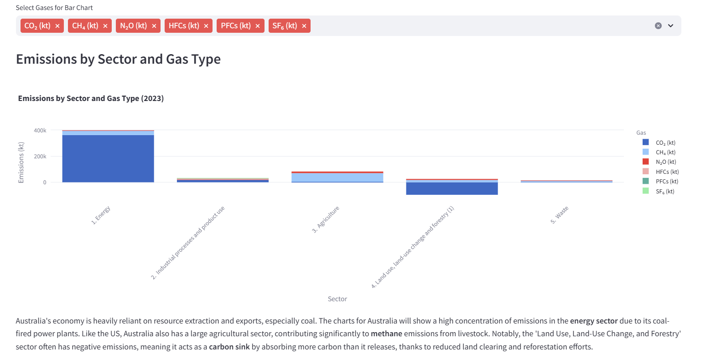

# 🌍 Welcome to the Global GHG Emissions Dashboard!

**An interactive journey through three decades of climate action data. Explore, understand, and connect the dots between global greenhouse gas emissions and their impacts, with advanced UNFCCC data processing.**

[](https://ghg-dashboard.streamlit.app/)
[](https://www.python.org/downloads/)
[](https://opensource.org/licenses/MIT)

---
## **Overview**

Welcome! This is the codebase for an advanced data visualisation dashboard that tells the story of global climate change through data. Complex, hard-to-use UNFCCC greenhouse gas inventory reports have been transformed into clear, interactive, and insightful visualisations.

This project isn't limited to displaying data; it also processes it. A sophicated data pipline that automatical tackles the formatting challenges of UNFCCC files has been built, extracting clean, anlaysis-ready data for over 40 Annex I countries. 
##  **Live Dashboard**

**[Explore the Dashboard Here](https://ghg-dashboard.streamlit.app/)**

*Dive into 30+ years of climate data from UNFCCC Annex I countries with interactive visualisations, policy analysis, and climate impact connctions.*



*Main dashboard interface showing global emissions data with interactive filtering options Explore emission trends, sector contributions, and policy contexts for individual nations.*

---
## Dashboard Features

### Interactive Global Emissions Map
- **Animated Time Series**: Watch emissions evolve from 1990-2023 with our animated choropleth map
- **Interactive Controls**: Play/pause animation or jump to specific years
- **Country Details**: Hover for detailed emission statistics
- **Policy Milestones**: Key climate agreements marked on timeline



*Watch global CO₂ emissions evolve over time with our animated choropleth map*

---
### Emissions Trends  
- **Multi-Gas Analysis**: Compare CO₂, CH₄, N₂O, SF₆, HFCs, and PFCs
- **Trend Detection**: Automatic calculation of emission trajectories
- **Peak Analysis**: Identify emission peaks and reduction periods
- **Future Projections**: Estimate years to net-zero at current rates


*Deep-dive into individual country emission trajectories and multi-gas analysis*


---
### Sector Distribution: 

- **Hierarchical Breakdown**: Drill down from sectors to sub-subsectors
- **Gas-Specific Views**: See which sectors emit which gases
- **Policy Integration**: Country-specific climate policies by sector
- **Global Commitments**: International targets and agreements


*Breakdown of emissions by economic sectors and sub-sectors.nderstand which economic activities and greenhouse gases are driving emissions.*

---
### Climate Impact: 
- Analyse the links between historical emissions and real-world climate impacts like extreme weather events.
### Data View: 
- Access, filter and download the processed datasets for your own research.
filtering capabilities


---


## Project Architecture

This project consists of two core components:

1.  **The Dashboard Frontend:** A Streamlit web application providing an intuitive user interface for data exploration.
2.  **The Data Processing Engine:** A robust Python package (`ghg_processing/`) designed specifically to clean, structure, and standardise raw UNFCCC data.

### The UNFCCC Data Challenge
UNFCCC data files are  difficult to work with, due to:
- Inconsistent Excel structures across countries and years
- Multi-level headers with embedded units
- Complex hierarchical category systems (IPCC)
- Country-specific formatting variations

**This automated pipeline solves these challenges, making this rich dataset truly accessible.**

---


## Codebase Structure

```

GHG_dashboard/
├── main.py                 # Main Streamlit application
├── requirements.txt        # Python dependencies│
├── helper
|   ├──data_loader.py          # Data loading & caching
|   └── utils.py               # Helper functions & UI components
|
├── data/                      # Data storage
│   ├── processed_data/        #  Output from the processing pipeline
|   ├── countries.geo.json     # Geographic data for mapping           
│   ├── crt/                   #  Input: Raw UNFCCC files go here
│   └── EM-DATA/               # Climate impact datasets
│
├── views/                      # Dashboard page modules
│   ├── ghg_map.py              # Interactive world map
│   ├── emissions_trends.py     # Country emission analysis
│   ├── sector_distribution.py    # Sectoral breakdown & policies
│   ├── climate_impact.py         # Climate impact connections
│   └── data_view.py              # Data exploration & downloads
│   
├── data_content/               # Static content & explanations
│   ├── policy_data.py             # Country climate policies
│   ├── sector_goals.py            # Global climate commitments
│   ├── gas_information.py         # Greenhouse gas explanations
│   └── chart_explanations.py     # Country-specific insights
│
├── ghg_processing/         # The Data Processing Engine
|   ├── unfccc/
|   │   ├── header_detector.py    # Smart header detection
|   │   ├── process_hierarchy.py  # IPCC category processing
|   │   └── process_sheets.py     # Batch workflow orchestrator
|   └── climate_impact/           # Other data source processors
|
├── images/                     # Screenshots & documentation
└── example_processing/         # Example preprocessing            
    ├── example use.ipynb       # Processing tutorial notebook 
    └── example_climate         # Preprocessing tutorial for climate impact dat         
  

```

---

## Requirements

### To Run the Dashboard Locally
* **Python** 3.8 or higher
* **pip** (Python package manager)
* **Git**
* **Git LFS** (Large File Storage)

### Git LFS Setup
This repository uses Git LFS to handle large data files. To clone and use this repository:

1. Install Git LFS:
```bash
# For Mac (using Homebrew)
brew install git-lfs

# For Windows
# Download from https://git-lfs.github.com

# For Ubuntu/Debian
sudo apt-get install git-lfs
```

2. Enable Git LFS:
```bash
git lfs install
```


### To Process New UNFCCC Data
*   The above, plus raw UNFCCC Common Reporting Format (CRT) `.xlsx` files placed in the `data/crt/` directory.

---

##  Installation & Quick Start

### Option 1: Use the Live Dashboard (Recommended)
Simply visit **[the live dashboard](https://ghg-dashboard.streamlit.app/)** – no installation required!

### Option 2: Run a Local Copy

**1. Clone the Repository**
```bash
git clone 
cd GHG_dashboard
```

**2. Create and Activate a Virtual Environment**
```bash
# Create
python -m venv ghg_env

# Activate (macOS/Linux)
source ghg_env/bin/activate
# Activate (Windows)
ghg_env\Scripts\activate
```

**3. Install Dependencies**
```bash
pip install -r requirements.txt
```

**4. Launch the Application**
```bash
streamlit run main.py
```
The dashboard will open automatically in your browser at `http://localhost:8501`.

---
---


##  Using the Data Processing Pipeline

#### **1. Process UNFCCC Data**
The `ghg_processing/unfccc` package is designed for batch processing UNFCCC CRT files.

### **Key Features**
- **Intelligent Header Detection**: Automatically finds data tables in complex Excel sheets
- **Hierarchical Processing**: Organises emissions into IPCC-compliant category structures
- **Multi-Gas Extraction**: Separates CO₂, CH₄, N₂O, SF₆, HFCs, PFCs with proper units
- **Batch Processing**: Handle multiple countries and years simultaneously
- **Efficient Storage**: Outputs to both Parquet (fast) and CSV (readable) formats

### Processing a Single Country
```python
from ghg_processing.unfccc.process_sheets import process_summary_sheet

process_summary_sheet(
    sheet_name="Summary2",              # The sheet to process
    folder_path="data/crt/Australia",   # Input folder for a specific country
    output_folder="data/processed_data",# Output directory
    save_csv=True                       # Save a CSV copy alongside .parquet
)
```

### Batch Processing All Countries
Place CRT files for each country in `data/crt/` and run a loop:

```python
import os
from ghg_processing.unfccc.process_sheets import process_summary_sheet

countries = [name for name in os.listdir("data/crt") if os.path.isdir(os.path.join("data/crt", name))]

for country in countries:
    print(f"Processing {country}...")
    process_summary_sheet("Summary2", f"data/crt/", "data/processed_data")
```

#### **2. Process Climate Impact Data**
```python
# Update extreme weather data
from ghg_processing.climate_impact.extreme_weather import process_extreme_weather_data
process_extreme_weather_data('data/raw/new_emdat.xlsx', 'data/EM-DATA/extreme_weather.parquet')

# Update temperature data  
from ghg_processing.climate_impact.temperature import process_temperature_anomalies
process_temperature_anomalies('data/raw/nasa_temp.csv', 'data/EM-DATA/temperature.parquet', (1990, 2024))
```

**For a complete tutorial, see the [Processing Examples Notebook](example_use.ipynb).**

---
---

##  **Data Download & Usage**

## Data Access

Due to file size limitations and Git LFS usage, the processed data is not directly downloadable through the dashboard. Instead, you can:

1. **Use the Live Dashboard**
   - Access and explore the data through our interactive visualiSations at [https://ghg-dashboard.streamlit.app/](https://ghg-dashboard.streamlit.app/)

2. **Process Data Locally**
   - Clone the repository with Git LFS support
   - Follow the data processing instructions in the [Processing Examples Notebook](example_use.ipynb)
   - Generate your own local copies of the processed datasets

### **Available Datasets**

| Dataset | Description | Format |
|---------|-------------|--------|
| **Total Emissions** | National-level GHG totals | Parquet/CSV | 
| **Sector Emissions** | Breakdown by economic sector | Parquet/CSV | 
| **Subsector Emissions** | Detailed sectoral breakdown | Parquet/CSV | 
| **Gas-Specific Data** | Individual greenhouse gases | Parquet/CSV |
| **Extreme Weather** | Climate disaster records | Parquet/CSV |
| **Temperature Data** | Global temperature anomalies | Parquet/CSV |

---
---

## **Data Sources & Methodology**

### **Primary Data Sources**

| Source | Dataset | Coverage | Update Frequency |
|--------|---------|----------|------------------|
| **UNFCCC** | National GHG Inventories | Annex I Countries, 1990-2023 | Annual |
| **EM-DAT** | International Disaster Database | Global extreme weather events | Real-time |
| **NASA GISS** | Global Temperature Analysis | Global temperature anomalies | Monthly |
| **Our World in Data** | Global Emissions Database | World emission totals | Annual |


##  **License & Attribution**

### **License**
This project is licensed under the **MIT License** - see the [LICENSE](LICENSE) file for details.

### **Data Attribution**
- **UNFCCC Data**: © United Nations Framework Convention on Climate Change
- **EM-DAT Data**: © Centre for Research on the Epidemiology of Disasters (CRED)
- **NASA Data**: © National Aeronautics and Space Administration
- **Our World in Data**: © Global Change Data Lab

### **Citation**
If you use this dashboard in your research, please cite:
```
GHG Emissions Dashboard (2024). 
Available at: https://ghg-dashboard.streamlit.app/
```

---


